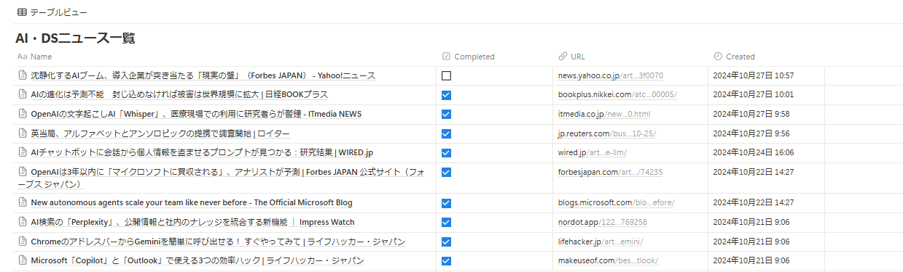

# Notionに収集したテクノロジー記事をまとめる

## 実現していること

Notionは次のようなイメージ。気になったニュース記事があったら、スマホからここに格納するというのを日課にしている。

この記事を、ざっくりとまとめて、後で振り返られるようにする。

Completedがチェックされていない記事を対象に、記事の内容をまとめて、サマリをマークダウン形式で出力する。

## シークレット変数

* OpenAIのAPIキーを、OPENAI_API_KEYとして保存

* NotionのAPIキーを、NOTION_API_KEYとして保存

* テーブルのURLから、https://www.notion.so/と?で挟まれている部分を、DATABASE_IDとして保存

